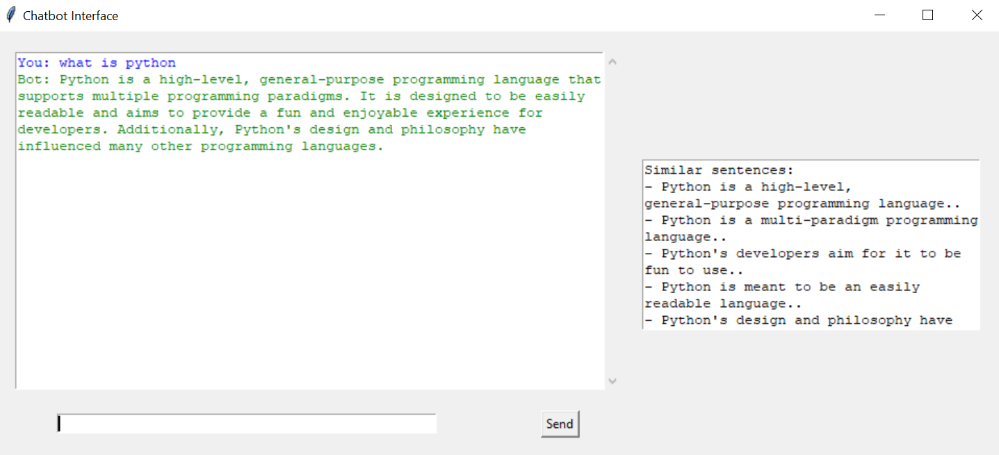
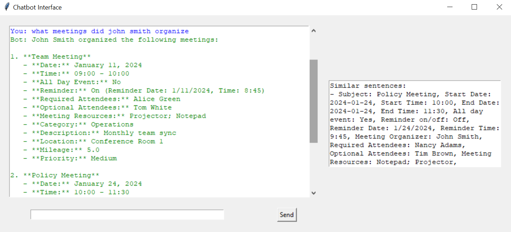
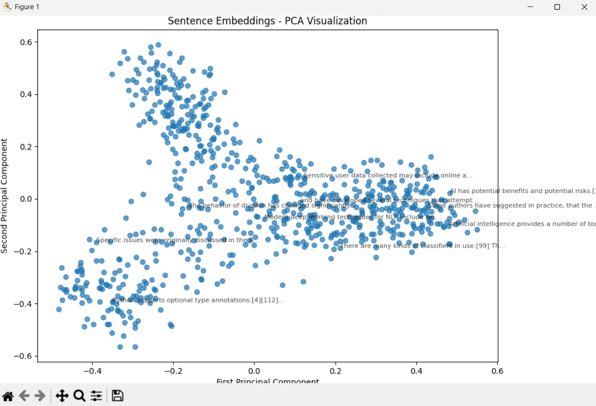

# AI-Powered Context-Aware Chatbot

## 🤖 Project Overview
This project implements a chatbot capable of answering user queries by utilizing similarity search over web-scraped and CSV data combined with an AI model for generating responses. It leverages the Milvus vector database for efficient similarity search, and Azure's OpenAI API to generate detailed responses based on context.

## 📸 Visual Demonstrations
### Answer to a Question About Links

This image shows the chatbot’s response when asked about links. It demonstrates the AI's ability to extract and process content from URLs and present relevant information clearly.

### Answer to a Question About CSV Files

In this image, the chatbot answers a query related to CSV files. It highlights the chatbot's capacity to understand and respond to questions involving structured data formats, showcasing its ability to handle diverse content queries effectively.

### Plot on 2D graph using PCA



## ✨ Key Features

- **Similarity Search**: The chatbot can find sentences most similar to a user's query using embeddings stored in the Milvus vector database.
- **Data Fetching**: It can fetch data from web pages (Wikipedia articles) and CSV files, processing them into sentences.
- **AI-powered Response Generation**: It utilizes the OpenAI API to generate detailed responses based on the context of the retrieved data.
- **Graphical User Interface (GUI)**: The project includes a simple Tkinter-based GUI for user interaction.

## 🛠 Technologies Used

- Python
- Sentence Transformers
- Milvus Vector Database
- Azure OpenAI
- BeautifulSoup
- Tkinter

## 📦 Prerequisites

- Python 3.8+
- Azure OpenAI API Access
- Milvus Vector Database

## 🚀 Installation

1. Clone the repository
   ```bash
   git clone https://github.com/milicaradicc/chatbot
   cd chatbot
   ```

2. Create a virtual environment
   ```bash
   python -m venv venv
   source venv/bin/activate  # On Windows, use `venv\Scripts\activate`
   ```

3. Install dependencies
   ```bash
   pip install -r requirements.txt
   ```

4. Set up environment variables
   Create a `.env` file with the following:
   ```
   MILVUS_HOST=localhost
   MILVUS_PORT=19530
   AZURE_ENDPOINT=your_azure_endpoint
   AZURE_API_KEY=your_azure_api_key
   SENTENCE_MODEL=all-MiniLM-L6-v2
   ```

## 🖥 Running the Application

```bash
python main.py
```
## How it works
- **Fetching Data**:
The DataFetcher class retrieves and processes web data (from URLs like Wikipedia) and CSV data.
The CSVDataFetcher class processes CSV files into rows, converting each row into a string of text.

- **Embedding Sentences**:
Sentences fetched from the web and CSV are then embedded using the Sentence Transformer model (all-MiniLM-L6-v2).
These embeddings are stored in a Milvus collection for efficient similarity search.

-**Similarity Search**:
When a user submits a query, the chatbot searches for similar sentences using the stored embeddings in Milvus.
It uses cosine similarity to find the most relevant sentences.

-**Response Generation**:
The OpenAI API (via Azure OpenAI) generates a response based on the query and the retrieved context (similar sentences).
If the chatbot can't answer with the existing context, it will leverage additional tools such as the Wikipedia or meeting database query functions to fetch more detailed information.

-**User Interface**:
The chatbot interface uses Tkinter, displaying the conversation history and providing a text box for the user to input queries.
Similar sentences are displayed in a separate section for transparency, so users can see the data used to generate the response.

**Directory Structure**
```bash
├── scripts  
│   ├── chatbot.py              # Main chatbot script with UI and logic
│   ├── config.py               # Configuration settings for environment variables
├── data/
│   ├── links                   # File containing URLs for data fetching
│   ├── data.csv                # CSV data file for meetings/events
├── requirements.txt            # List of Python dependencies
└── .env                        # Environment variable file```
```

**Troubleshooting**
Common Issues:
*Milvus Connection Error*: 
Ensure that the Milvus service is running locally or accessible remotely. You can start Milvus using Docker or through its official installation guide.
*Missing CSV or URL File*: 
Ensure that the data/links and data/data.csv files are correctly set up and populated.
*API Key Errors*: 
Ensure your Azure OpenAI API key is correct and that your endpoint is active.

**Milvus Setup**:
If you're using Milvus locally, you can start it with Docker:

```bash
docker run -d --name milvus -p 19530:19530 milvusdb/milvus:v2.0.0
```
Alternatively, follow the Milvus installation guide for other setup options.

## 📞 Contact

Milica Radic - milica.t.radic@gmail.com

Project Link: [https://github.com/milicaradicc/chatbot](https://github.com/milicaradicc/chatbot)

